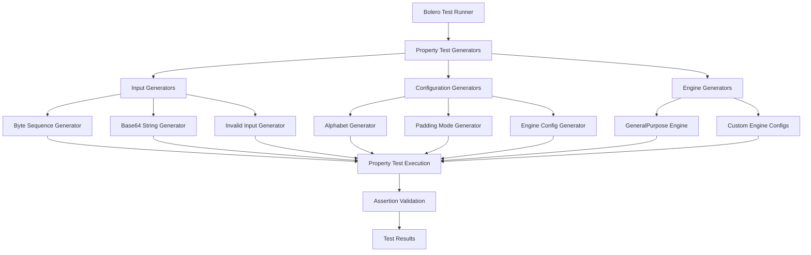

# Design Document: Comprehensive Base64 Testing Suite

## Overview

This design outlines a comprehensive property-based testing suite for the rust-base64 library using the bolero testing framework. The suite will validate correctness, performance characteristics, error handling, and configuration compliance across all supported features of the library.

The testing approach leverages bolero's property-based testing capabilities to generate random inputs and verify universal properties that should hold for all valid inputs. This provides much more comprehensive coverage than traditional example-based unit tests.

## Architecture

### Testing Framework Architecture



### Test Organization Structure

The test suite will be organized into logical modules that mirror the library's functionality:

1. **Core Roundtrip Tests** - Fundamental encode/decode correctness
2. **Alphabet Compliance Tests** - Character set validation
3. **Padding Behavior Tests** - Padding mode correctness
4. **Length Calculation Tests** - Buffer size accuracy
5. **Error Handling Tests** - Invalid input detection
6. **Streaming Operation Tests** - Streaming API consistency
7. **Configuration Tests** - Engine configuration behavior
8. **Performance Characteristic Tests** - Memory and time complexity
9. **Edge Case Tests** - Boundary condition handling

## Components and Interfaces

### Input Generators

**ByteSequenceGenerator**
- Generates arbitrary byte sequences of varying lengths (0 to 10MB)
- Includes edge cases: empty sequences, single bytes, maximum size sequences
- Provides both random and structured patterns

**Base64StringGenerator**
- Generates valid base64 strings using different alphabets
- Includes properly padded and unpadded variants
- Generates strings with different length characteristics

**InvalidInputGenerator**
- Generates invalid base64 strings with specific error patterns
- Invalid characters, incorrect padding, wrong lengths
- Systematic coverage of all error conditions

**ConfigurationGenerator**
- Generates all valid combinations of alphabets and padding modes
- Includes standard configurations (STANDARD, URL_SAFE, IMAP_MUTF7)
- Generates custom alphabet configurations

### Property Test Modules

**RoundtripPropertyTests**
```rust
// Core interface for roundtrip testing
trait RoundtripTest {
    fn test_encode_decode_roundtrip(input: &[u8], config: &EngineConfig) -> bool;
    fn test_decode_encode_roundtrip(input: &str, config: &EngineConfig) -> bool;
    fn test_cross_engine_consistency(input: &[u8], config1: &EngineConfig, config2: &EngineConfig) -> bool;
}
```

**AlphabetComplianceTests**
```rust
// Interface for alphabet validation
trait AlphabetTest {
    fn test_output_character_compliance(input: &[u8], alphabet: &Alphabet) -> bool;
    fn test_invalid_character_detection(input: &str, alphabet: &Alphabet) -> bool;
    fn test_custom_alphabet_behavior(input: &[u8], custom_chars: &[u8; 64]) -> bool;
}
```

**ErrorHandlingTests**
```rust
// Interface for error condition testing
trait ErrorTest {
    fn test_invalid_byte_detection(input: &str, expected_pos: usize) -> bool;
    fn test_invalid_length_detection(input: &str) -> bool;
    fn test_padding_error_detection(input: &str, padding_mode: PaddingMode) -> bool;
}
```

### Test Execution Engine

**PropertyTestRunner**
- Orchestrates execution of all property tests
- Manages test configuration and reporting
- Provides parallel execution capabilities
- Integrates with bolero's test runner

**AssertionValidator**
- Validates property assertions
- Provides detailed failure reporting
- Tracks test coverage metrics
- Generates counterexamples for failures

## Data Models

### Test Configuration Model

```rust
#[derive(Debug, Clone)]
pub struct TestConfig {
    pub alphabet: AlphabetType,
    pub padding_mode: PaddingMode,
    pub engine_type: EngineType,
    pub test_iterations: usize,
    pub max_input_size: usize,
}

#[derive(Debug, Clone)]
pub enum AlphabetType {
    Standard,
    UrlSafe,
    ImapMutf7,
    Custom([u8; 64]),
}

#[derive(Debug, Clone)]
pub enum PaddingMode {
    Canonical,
    None,
    Indifferent,
    RequireCanonical,
    RequireNone,
}
```

### Test Result Model

```rust
#[derive(Debug)]
pub struct PropertyTestResult {
    pub property_name: String,
    pub iterations_run: usize,
    pub success: bool,
    pub counterexample: Option<TestInput>,
    pub execution_time: Duration,
    pub memory_usage: Option<usize>,
}

#[derive(Debug)]
pub struct TestInput {
    pub raw_input: Vec<u8>,
    pub config: TestConfig,
    pub expected_behavior: ExpectedBehavior,
}
```

### Error Classification Model

```rust
#[derive(Debug, PartialEq)]
pub enum ExpectedError {
    InvalidByte { position: usize, byte: u8 },
    InvalidLength { length: usize },
    InvalidLastSymbol { position: usize },
    InvalidPadding { position: usize },
    BufferTooSmall { required: usize, provided: usize },
}
```

Now I need to use the prework tool to analyze the acceptance criteria before writing the Correctness Properties section.

<function_calls>
<invoke name="prework">
<parameter name="featureName">base64-comprehensive-testing

## Correctness Properties

*A property is a characteristic or behavior that should hold true across all valid executions of a system—essentially, a formal statement about what the system should do. Properties serve as the bridge between human-readable specifications and machine-verifiable correctness guarantees.*

Based on the prework analysis, the following properties will be implemented as bolero property-based tests:

### Core Roundtrip Properties

**Property 1: Encode-Decode Roundtrip**
*For any* byte sequence, encoding then decoding should produce the original byte sequence
**Validates: Requirements 1.1**

**Property 2: Decode-Encode Roundtrip**
*For any* valid base64 string, decoding then encoding should produce an equivalent base64 string (accounting for padding normalization)
**Validates: Requirements 1.2**

**Property 3: Cross-Engine Consistency**
*For any* byte sequence and any two engine configurations with the same alphabet and padding settings, both engines should produce identical encoded output
**Validates: Requirements 1.3, 7.1**

**Property 4: Custom Alphabet Roundtrip**
*For any* byte sequence and any valid custom alphabet, encoding with that alphabet then decoding should produce the original byte sequence
**Validates: Requirements 1.4**

**Property 5: Padding Mode Roundtrip**
*For any* byte sequence and any padding mode configuration, encoding then decoding should preserve the original data regardless of padding mode
**Validates: Requirements 1.5**

### Alphabet Compliance Properties

**Property 6: Character Set Compliance**
*For any* byte sequence and any alphabet configuration, all characters in the encoded output should belong to the specified alphabet's character set
**Validates: Requirements 2.1, 2.2, 2.3, 2.4**

**Property 7: Invalid Character Detection**
*For any* string containing characters not in the specified alphabet, decoding should return a DecodeError with InvalidByte information
**Validates: Requirements 2.5**

### Padding Behavior Properties

**Property 8: Canonical Padding Addition**
*For any* byte sequence that requires padding when using canonical padding mode, the encoded output should end with the correct number of '=' characters
**Validates: Requirements 3.1**

**Property 9: No Padding Omission**
*For any* byte sequence when no-padding mode is configured, the encoded output should contain no '=' characters
**Validates: Requirements 3.2**

**Property 10: Strict Padding Validation**
*For any* improperly padded base64 string when RequireCanonical mode is set, decoding should return a DecodeError with InvalidPadding information
**Validates: Requirements 3.3**

**Property 11: Padding Rejection**
*For any* padded base64 string when RequireNone mode is set, decoding should return a DecodeError with InvalidPadding information
**Validates: Requirements 3.4**

**Property 12: Padding Tolerance**
*For any* base64 string (padded or unpadded) when Indifferent mode is set, decoding should succeed if the content is otherwise valid
**Validates: Requirements 3.5**

### Length Calculation Properties

**Property 13: Encoded Length Accuracy**
*For any* byte sequence and engine configuration, the calculated encoded length should exactly match the actual length of the encoded output
**Validates: Requirements 4.1**

**Property 14: Decoded Length Accuracy**
*For any* valid base64 string, the calculated decoded length should exactly match the actual length of the decoded output
**Validates: Requirements 4.2**

**Property 15: Buffer Size Sufficiency**
*For any* operation where buffer size is calculated, the calculated size should always be sufficient to complete the operation without overflow
**Validates: Requirements 4.5**

### Error Detection Properties

**Property 16: Invalid Byte Error Reporting**
*For any* string with invalid characters at known positions, decoding should return DecodeError::InvalidByte with the correct position and byte value
**Validates: Requirements 5.1**

**Property 17: Invalid Length Error Reporting**
*For any* string with invalid base64 length, decoding should return DecodeError::InvalidLength
**Validates: Requirements 5.2**

**Property 18: Invalid Last Symbol Error Reporting**
*For any* string with malformed final symbols, decoding should return DecodeError::InvalidLastSymbol with the correct position
**Validates: Requirements 5.3**

**Property 19: Invalid Padding Error Reporting**
*For any* string with incorrect padding, decoding should return DecodeError::InvalidPadding with the correct position
**Validates: Requirements 5.4**

**Property 20: Buffer Overflow Error Reporting**
*For any* operation with insufficient buffer space, the operation should return appropriate slice error types without writing beyond buffer boundaries
**Validates: Requirements 5.5**

### Streaming Operation Properties

**Property 21: Streaming Decode Consistency**
*For any* valid base64 input, streaming decode using DecoderReader should produce identical results to batch decode operations
**Validates: Requirements 6.1**

**Property 22: Streaming Encode Consistency**
*For any* byte sequence, streaming encode using EncoderWriter should produce identical results to batch encode operations
**Validates: Requirements 6.2**

**Property 23: Streaming Error Consistency**
*For any* invalid input, streaming operations should report the same errors as batch operations for the same input
**Validates: Requirements 6.3**

**Property 24: Streaming State Management**
*For any* input split across multiple streaming operations, the final result should be identical to processing the complete input in a single operation
**Validates: Requirements 6.4**

**Property 25: Streaming Completion**
*For any* streaming operation, all input data should be properly processed and flushed when the operation completes
**Validates: Requirements 6.5**

### Configuration Properties

**Property 26: Configuration Change Responsiveness**
*For any* engine configuration change, the new behavior should be immediately reflected in subsequent operations
**Validates: Requirements 7.2**

**Property 27: Invalid Configuration Rejection**
*For any* invalid configuration parameters, engine creation should fail with clear error messages
**Validates: Requirements 7.3**

**Property 28: RFC 4648 Default Compliance**
*For any* operation using default configuration, the behavior should comply with RFC 4648 specifications
**Validates: Requirements 7.4**

### Memory Safety Properties

**Property 29: Buffer Boundary Respect**
*For any* slice-based operation with exact buffer sizes, the operation should never write beyond the provided buffer boundaries
**Validates: Requirements 8.2**

**Property 30: Thread Safety**
*For any* concurrent operations on the same engine configuration, all operations should complete successfully without data races or inconsistencies
**Validates: Requirements 8.5**

### Edge Case Properties

**Property 31: Unusual Valid Input Handling**
*For any* unusual but valid base64 formatting, the decoder should process the input correctly and produce the expected output
**Validates: Requirements 9.4**

**Property 32: Buffer Boundary Predictability**
*For any* operation at exact buffer size boundaries, the behavior should be predictable and consistent
**Validates: Requirements 9.5**

## Error Handling

The error handling strategy focuses on comprehensive error detection and clear error reporting:

### Error Classification System

1. **Input Validation Errors**
   - Invalid characters with position information
   - Invalid input length detection
   - Malformed symbol detection

2. **Configuration Errors**
   - Invalid alphabet specifications
   - Incompatible padding mode combinations
   - Buffer size calculation errors

3. **Runtime Errors**
   - Buffer overflow detection
   - Memory allocation failures
   - Streaming operation state errors

### Error Recovery Strategies

- **Fail-Fast Approach**: Invalid inputs are detected early and operations fail immediately
- **Detailed Error Information**: All errors include position information and context
- **No Silent Failures**: All error conditions are explicitly reported
- **Consistent Error Types**: Same error conditions always produce the same error types

## Testing Strategy

### Dual Testing Approach

The testing strategy employs both unit tests and property-based tests as complementary approaches:

**Unit Tests**:
- Specific examples demonstrating correct behavior
- Edge cases like empty input, maximum size inputs
- Integration points between components
- Error condition examples with known inputs

**Property-Based Tests**:
- Universal properties that hold for all inputs
- Comprehensive input coverage through randomization
- Systematic exploration of the input space
- Validation of mathematical properties like roundtrip correctness

### Property-Based Testing Configuration

**Framework**: Bolero property-based testing framework for Rust
**Test Iterations**: Minimum 1000 iterations per property test (due to randomization)
**Input Generation**: Custom generators for byte sequences, base64 strings, and configurations
**Shrinking**: Automatic counterexample minimization when properties fail

**Test Tagging Format**:
Each property test must be tagged with a comment referencing the design document property:
```rust
// Feature: base64-comprehensive-testing, Property 1: Encode-Decode Roundtrip
```

### Test Coverage Requirements

- Each correctness property must be implemented by exactly one property-based test
- All acceptance criteria must be covered by either property tests or unit tests
- Edge cases identified in requirements must have dedicated test coverage
- Error conditions must be systematically tested with both valid and invalid inputs

### Performance Testing Considerations

While property-based tests focus on correctness, the following performance characteristics will be validated:
- Memory usage patterns for slice-based operations
- Linear time complexity for large inputs (through timing analysis)
- Thread safety under concurrent access patterns

The testing suite will provide comprehensive validation of the rust-base64 library's correctness, robustness, and compliance with base64 specifications across all supported configurations and use cases.